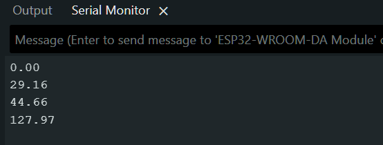

# Hardware Timers Challenge
Your challenge is to create a sampling, processing, and interface system using hardware interrupts and whatever kernel objects (e.g. queues, mutexes, and semaphores) you might need.

You should implement a hardware timer in the ESP32 (here is a good article showing how to do that) that samples from an ADC pin once every 100 ms. This sampled data should be copied to a double buffer (you could also use a circular buffer). Whenever one of the buffers is full, the ISR should notify Task A.

Task A, when it receives notification from the ISR, should wake up and compute the average of the previously collected 10 samples. Note that during this calculation time, the ISR may trigger again. This is where a double (or circular) buffer will help: you can process one buffer while the other is filling up.

When Task A is finished, it should update a global floating point variable that contains the newly computed average. Do not assume that writing to this floating point variable will take a single instruction cycle! You will need to protect that action as we saw in the queue episode.

Task B should echo any characters received over the serial port back to the same serial port. If the command “avg” is entered, it should display whatever is in the global average variable.

# Solution

